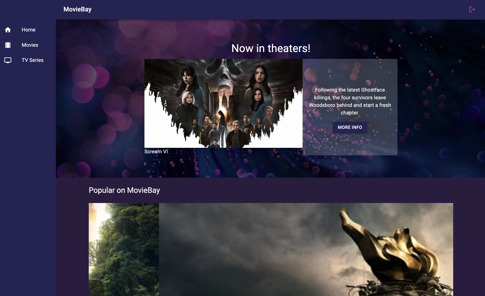

# Movie Hub

A movie landing page. Using the movie database API of www.themoviedb.org

## Getting Started

These instructions will give you a copy of the project up and running on
your local machine for development and testing purposes. See deployment
for notes on deploying the project on a live system.

### Prerequisites

You need to have installed Node and React.
Also you need to create a API from  www.themoviedb.org in order to call the API.
After that you will need to create your own .dev file, completing the data with your credentials of themoviedb.org, there is a .env.example in the repo

### Installing

A step by step series of examples that tell you how to get a development
environment running

1.Install all dependencies

    npm install

And to run the project

    npm run dev

### Next steps
Due to time constraints, I wasn't able to finish all the tasks. However, I'll provide a breakdown of the next steps I intend to take:

1. Finalize the utilization of store data:

Current progress: I've replaced the data for popular movies. The structure is already in place, and I just need to replicate it for TV series.

3. Implement a feature to save favorite TV series and movies:

Current progress: The feature is partially developed. I need to complete the implementation.

4. Install Testing Library in the project for conducting the requested tests:

This step involves integrating the Testing Library package into the project to enable the creation and execution of test cases.

5. Also I'm working with this [dashboard](https://github.com/users/MartinRob13/projects/2/views/1): and this will help with the control of the tasks.

### Architecture

Should the application grow in size, I would cease direct API usage. Instead, I would employ a cron job on the application server to periodically fetch the necessary data and store it in a database. This approach would prioritize database queries over API calls, minimizing API strain. 
Additionally, it would facilitate the implementation of user-specific favorites functionality and a user login system, with user credentials validated against the database.
